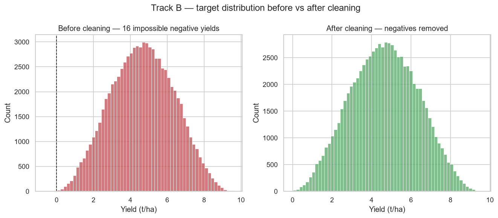
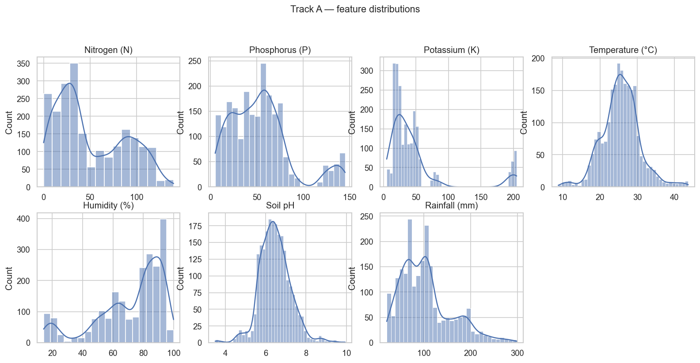
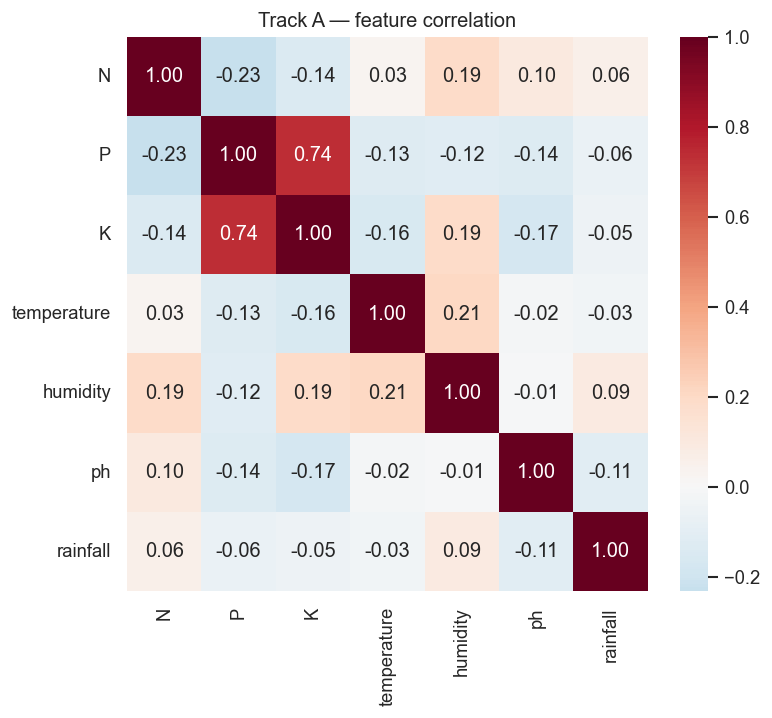
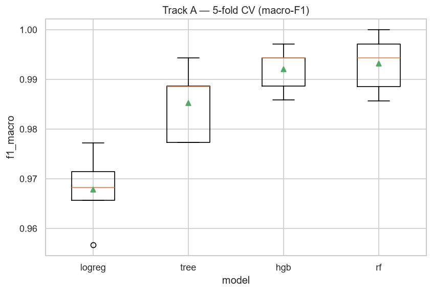
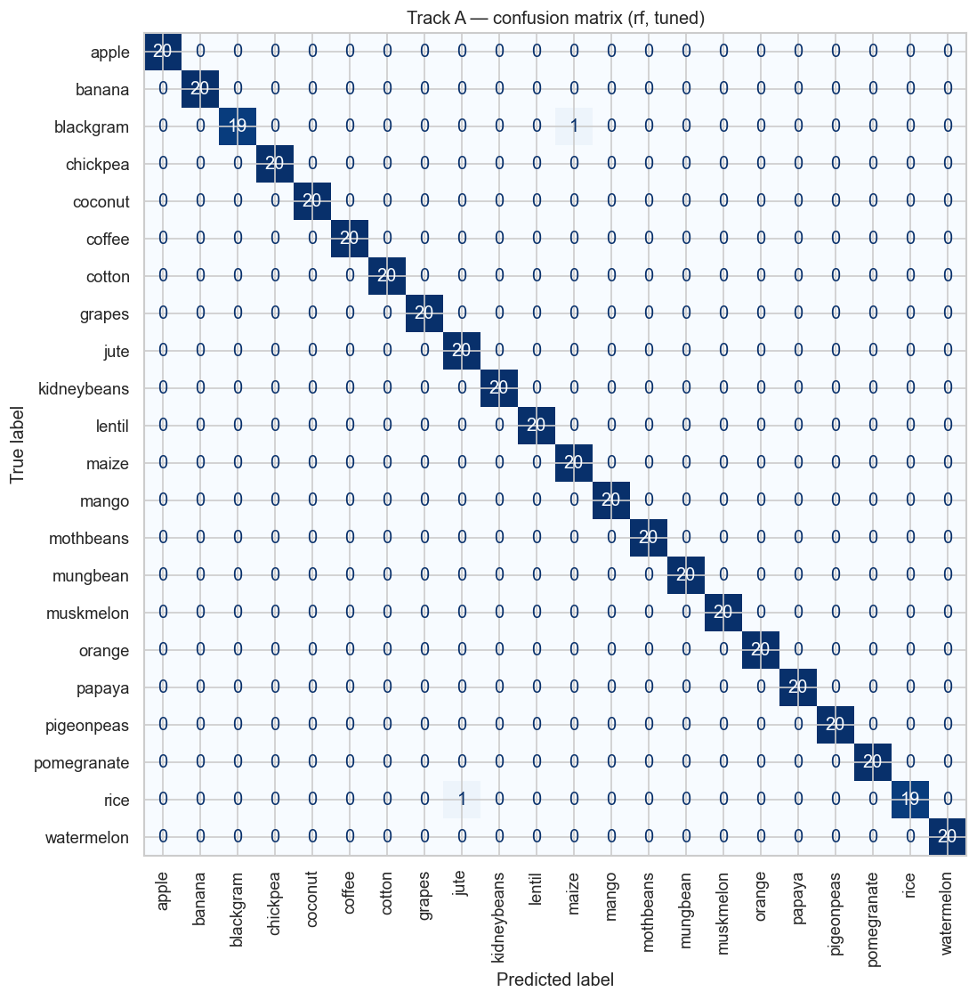
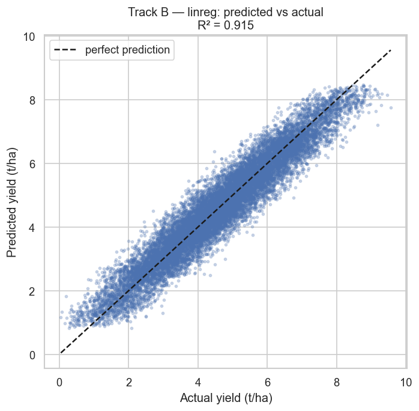
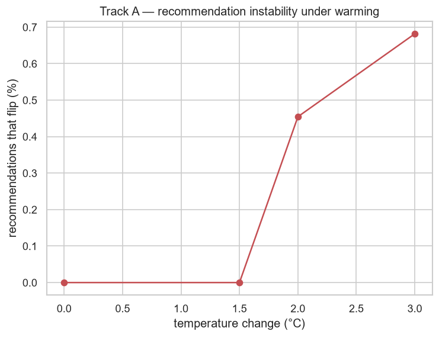
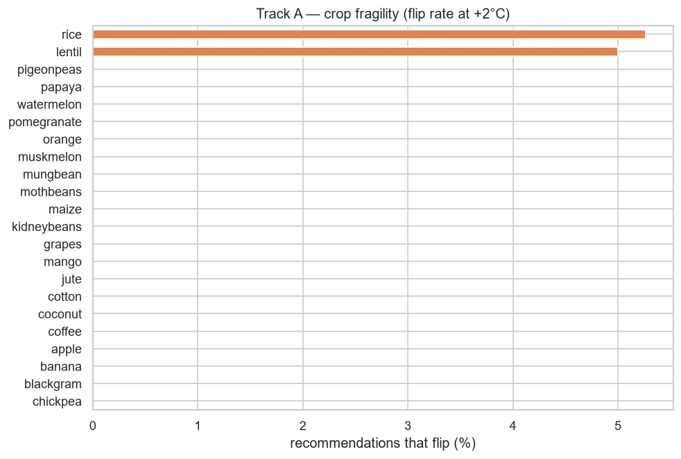
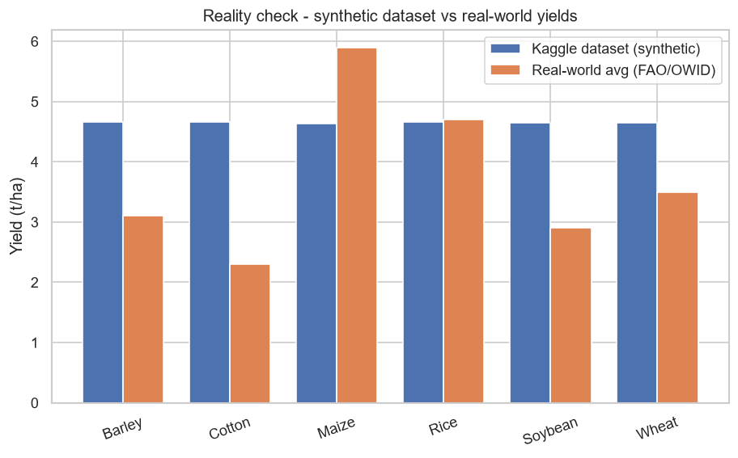

# Smart Farming — Crop Recommendation & Yield Prediction
### Explainable, climate-robust machine learning for agro-environmental decision support

**Course:** Practical Machine Learning (Aprendizagem Automática Aplicada) — GreenDS MSc 2025/2026, ISA / ULisboa
**Instructor:** Manuel Campagnolo
**Authors:** Aster Noel Dsouza (29211) · David Heleno Bebiano Da Costa Morais (29400)
**Category:** Tabular data — multi-class classification + regression, with explainability and a climate-scenario analysis
**Repository:** https://github.com/honestfarmer-cod/smart-farming-crop-ml  *(update if the repo name differs)*

---

## 1. Introduction

Two questions sit at the heart of any planting decision: *which crop should I grow* given my
soil and climate, and *how much will it yield*? We build machine-learning models for both (a
crop **recommender** classifier and a **yield** regressor), then go past the
usual accuracy table in two ways that matter for climate adaptation. First, we **explain** what
drives each decision, because advice a farmer cannot interrogate is advice they will not trust.
Second, we **stress-test** the models under warming and drought, because a recommendation that is
correct today is only useful if we know whether it survives a +2 °C world.

This framing is deliberate. The crop-recommendation task on this data is close to solved (a
plain classifier scores around 99%), so chasing accuracy would add little. The contribution we
actually deliver is the explainability layer and the climate-robustness analysis, plus an honest
reality-check of the data against real-world yields. The project also continues a thread from our
Introduction-to-Python "Smart Farming" prototype, rebuilt here with a proper, leakage-free
pipeline.

## 2. Data

We use two public Kaggle datasets and one small real-world reference table.

**Track A — Crop Recommendation** (2,200 rows). Augmented from Indian rainfall, climate and
fertiliser records. Seven numeric inputs (nitrogen, phosphorus, potassium, temperature,
humidity, pH and rainfall) map to one of 22 crops. The classes are perfectly balanced (exactly
100 rows each), there are no missing values, and every feature sits inside an agronomically
sensible range. This tidiness is itself informative: the set is clean and nearly separable.

**Track B — Agriculture Crop Yield** (1,000,000 rows). Region, soil type, crop, weather and two
management flags (fertiliser, irrigation) plus rainfall, temperature and growing-season length
map to a yield in t/ha. Data types are mixed: four categoricals, two booleans and four numerics
(see `data.dtype_table`). The one real quality problem is **231 physically impossible negative
yields** (an artefact of the Gaussian noise used to synthesise the set); we drop them. We add one
engineered feature, `rain_per_day` = rainfall ÷ days-to-harvest, which is more physical than
rainfall alone. Because a million rows is overkill for a CPU, we model on an 80,000-row
stratified-by-crop subsample; the code uses the full file automatically if it is present.

**Cleaning, before and after.** The negative-yield cleaning step is shown explicitly below,
the kind of evidence that is easy to claim and better to actually show.

**What the features look like.** Track A's inputs are multi-modal: different crop groups occupy
different parts of each range, which is what makes the classification close to separable.

## 3. Data organization

For both tracks we hold out **20% as a test set** that is touched only once, at the very end.
Model selection and tuning happen on the remaining 80% using **5-fold cross-validation**, so the
CV folds act as the validation set and the test set never leaks into any choice we make. Track A
is split with **stratification** so each crop keeps its balance (80/20 within every class); Track
B uses a plain random split because its rows are independent draws. All preprocessing
(imputation, scaling, one-hot encoding) lives *inside* the scikit-learn `Pipeline`, so it is
fitted on training folds only.

| | rows (model) | train | test | validation |
|---|---|---|---|---|
| Track A | 2,200 | 1,760 | 440 | 5-fold CV on train |
| Track B | 80,000 (subsample) | 64,000 | 16,000 | 5-fold CV on train |

## 4. Methods

**Pipeline.** Each model is wrapped with its preprocessing in a single `Pipeline`
(`ColumnTransformer` → estimator). Track A scales the seven numerics; Track B scales the numeric
branch and one-hot encodes the four categoricals. This is the single most important guard against
data leakage and keeps every model directly comparable.

**Models, simplest to most expressive.** We walk up a deliberate ladder so the final choice is
*justified* rather than asserted:

- *Classification (Track A):* Logistic Regression (transparent linear baseline) → Decision Tree
  (readable "if rainfall > x" rules) → Random Forest → HistGradientBoosting.
- *Regression (Track B):* Linear Regression (a serious baseline, since the EDA suggests an
  additive target) → Decision Tree → Random Forest → XGBoost.

**Selection, tuning, comparison.** We compare all models with 5-fold CV (macro-F1 for the
imbalance-agnostic classification view; R² for regression), take the best to `GridSearchCV` for
hyper-parameter tuning, and only then evaluate on the test set. Models are compared with a
**paired t-test** on the per-fold scores so "better" means statistically better, not luckier.

**Explainability.** Permutation importance (model-agnostic, in original units) and SHAP
(per-prediction attributions). When the two agree we trust the story.

**Climate-scenario stress test (the novel part).** We re-query the trained models on perturbed
inputs (temperature +1.5/+2/+3 °C and rainfall ±10–30%, plus a combined warming+drought case)
and measure recommendation **flip-rate** (Track A) and **yield shift** (Track B), then rank crops
from climate-robust to climate-fragile.

## 5. Results

### Track A — crop recommendation

All four classifiers score highly on this near-separable data; the ensembles are the most
consistent across folds. The tuned **rf** reached **99.5%**
test accuracy, **0.995** macro-F1 and **1.000** one-vs-rest macro
ROC-AUC. The paired t-test confirms the ensemble is significantly better than the logistic
baseline (p = 7.3e-03).

The confusion matrix shows the few remaining errors fall between agronomically similar crops (the
pulses), exactly where we would expect a sensible model to hesitate.

### Track B — yield prediction

| Model | R² | RMSE | MAE |
|---|---|---|---|
| Linear regression | 0.915 | 0.495 | 0.395 |
| Best (linreg) | 0.915 | 0.495 | 0.395 |

Linear regression already captures most of the variance, and the ensembles add little, because
the data is close to linear and additive, so there is not much non-linear signal to find. The
predicted-vs-actual plot makes the ceiling visible: predictions track the diagonal but scatter
around it by an amount set by the data's built-in noise.

### Climate-scenario stress test

As temperature rises, a growing fraction of recommendations flip; the per-crop ranking tells us
*which* crops are most fragile: the ones whose soil/climate niche sits near a decision boundary.
For yield, the warming curve and the per-crop response show how much expected output moves under a
combined +2 °C / −20% rain scenario.

## 6. Analysis

Three findings stand out.

**Accuracy is not the story.** Track A saturates because the crops occupy distinct niches; the
value is in *why* and *how stable*. Permutation importance and SHAP agree that rainfall, humidity
and potassium dominate the recommendation, the same variables an agronomist would name first,
which is reassuring evidence the model learned real structure.

**The climate stress test turns a black box into an adaptation tool.** Ranking crops by flip-rate
identifies where advice is least robust to warming, which is precisely where a farmer should hedge.
We are honest about two caveats: the scenarios extrapolate slightly beyond the training range, so
they are directional rather than forecasts; and the yield model inherits the data's limits.

**The yield data does not match reality, and we can show it.** Comparing the dataset's per-crop
average yields with real global averages (FAO / Our World in Data) exposes a clear gap: in the
dataset every crop sits at almost the same yield (~4.6 t/ha, cross-crop standard deviation ≈ 0.01),
whereas real yields differ sharply (maize ≈ 5.9, soybean ≈ 2.9, cotton ≈ 2.3; standard deviation
≈ 1.3). In the real world the crop is one of the strongest yield drivers, which is exactly why
crop identity had near-zero importance in our explainability analysis. The yield track is
therefore a sound *methods sandbox*, but its absolute numbers should not be read as agronomic
truth. The recommendation track, built from real Indian climate/fertiliser ranges, is on firmer
ground.

## 7. Deployment

The two models are deployed as a live Gradio app on Hugging Face Spaces:
**https://huggingface.co/spaces/asternoeld/smart-farming-crop-ml**

The app exposes both models: enter soil and climate to get the top-3 recommended crops with a
+2 °C climate-stability flag, or enter management conditions to get an estimated yield. It loads
the exact pipelines saved by `run_pipeline.py`, so the deployed behaviour matches the report.

## 8. Conclusions

We built a clean, leakage-free pipeline for two linked agro-environmental tasks, compared course
models with proper cross-validation and statistical tests, explained the decisions, and (the part
we set out to deliver) stress-tested both models under climate change and checked them against
real-world data. The honest result is a recommender that is accurate *and* whose stability we can
quantify, and a yield model that is methodologically sound but limited by synthetic data, a
limitation we demonstrate rather than hide.

## 9. References

- Raschka, Liu & Mirjalili (2022). *Machine Learning with PyTorch and Scikit-Learn*. Packt.
- Ingle, A. (2021). *Crop Recommendation Dataset*. Kaggle.
- Otieno, S. *Agriculture Crop Yield*. Kaggle.
- FAO (2023). *World Food and Agriculture — Statistical Yearbook*; FAOSTAT crop yields.
- Ritchie, Roser & Rosado. *Crop Yields*. Our World in Data (FAO-based).
- Lundberg & Lee (2017). *A Unified Approach to Interpreting Model Predictions* (SHAP). NeurIPS.

## 10. Contributions

- **David Heleno Bebiano Da Costa Morais** — data preparation and EDA, Track A (recommendation) modelling, the
  explainability analysis, climate-scenario design, and report integration.
- **Aster Noel Dsouza** — Track B (yield) modelling and error analysis, the
  OECD/FAO reality check, the Gradio app, and the cross-course (AVCAD) visuals.

Each member also recorded an individual ≤5-minute video walking through their part.

## Appendix — Use of AI

We used an AI assistant to help draft the code (pipeline structure and plotting helpers) and to
edit language. Following the course guidelines, each code file records the prompt used in a comment
beginning with the word 'prompt', along with notes on the changes we made. All modelling choices,
the climate-scenario design, the analysis and the conclusions are our own, and every result is
reproducible by running `python run_pipeline.py`.
